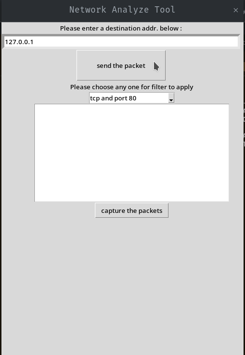
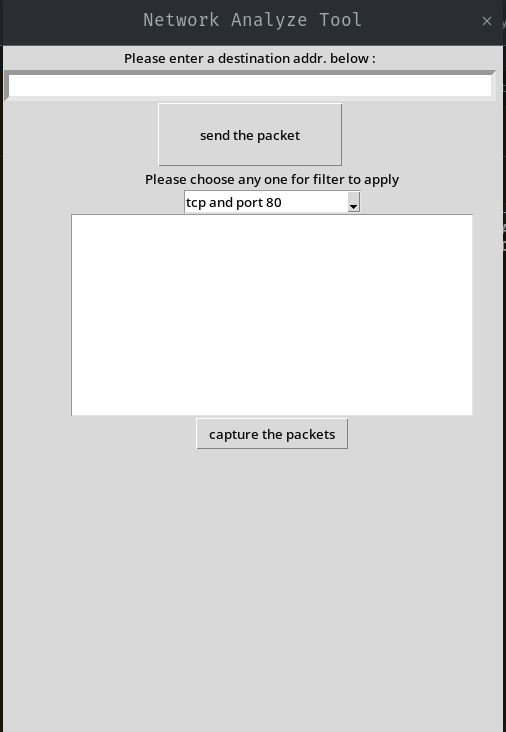
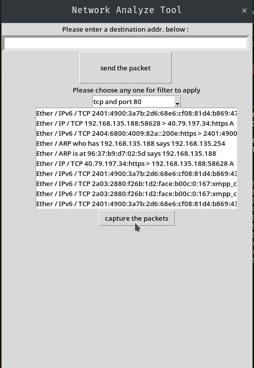

# Packet Capturing Tool


## Screenshots





## Table of Contents

- [Introduction](#introduction)
- [Features](#features)
- [Installation](#installation)
- [Usage](#usage)
- [Requirements](#requirements)
- [Configuration](#configuration)
- [Contributing](#contributing)
- [License](#license)

## Introduction

Packets Capturing Tool is a powerful and easy-to-use tool for capturing and analyzing network packets. It is built with Python and library Scapy for packet manipulation and tkinter as the GUI framework. This tool is ideal for network administrators, security analysts, and anyone interested in network traffic analysis.

## Features

- Capture live network traffic
- Save captured packets to a file
- Display detailed packet information
- Filter packets based on protocols (TCP, UDP, ICMP, etc.)
- User-friendly command-line interface

## Installation

To install and run the Packets Capturing Tool, follow these steps:

1. **Clone the repository:**

    ```bash
    git clone https://github.com/yourusername/packets-capturing-tool.git
    ```

2. **Navigate to the project directory:**

    ```bash
    cd packets-capturing-tool
    ```

3. **Install the required dependencies:**

    ```bash
    pip install -r requirements.txt
    ```

## Usage

To use the Packets Capturing Tool, you need to have administrative privileges. The following sections provide examples of how to run the tool and capture packets.

### Basic Usage

Run the tool with administrative privileges:

```bash
sudo python3 net-analyzer.py
```

## Example

- Enter any text: Hello World.
- Click "Generate Hash".
- Output hash value will be displayed below.

## Contributing
Contributions are welcome! Please follow these steps:

- Fork the repository.
- Create a new branch: git checkout -b feature-branch-name.
- Make your changes.
- Commit your changes: git commit -m 'Add some feature'.
- Push to the branch: git push origin feature-branch-name.
- Open a pull request.

